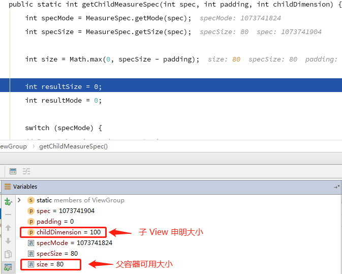
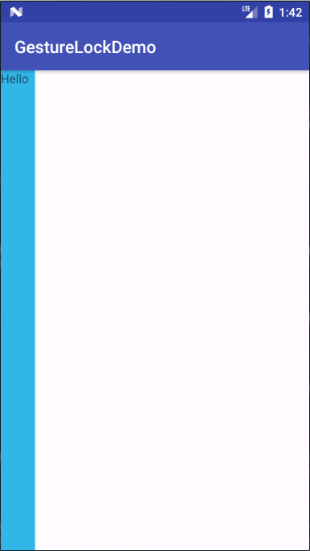
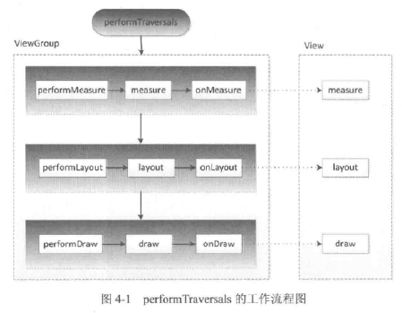
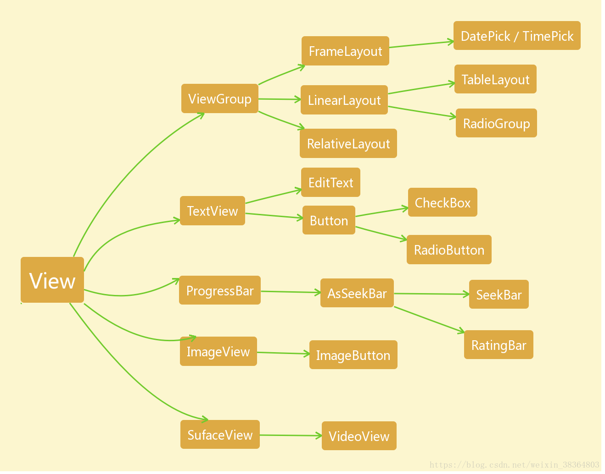

## 实现思路

1. 根据用户设置的图片，绘制九张图片
2. 根据用户设置的大小，计算图片的位置
3. 手势滑动显示路线
4. 回调封装


## ViewRootImp 和 DecorView
**ViewRootImp 是什么？**

ViewRootImp 是连接 WindowManager 和 DecorView 的纽带，View 的三大流程均是通过 ViewRootImpl 完成的。

**DecorView 是什么？**

DecoView 继承自 FrameLayout 作为顶级 View，它包含一个竖直方向的 LinearLayout。该 LinearLayout 包含标题和内容两部分，内容部分是 id 为 content 的 FrameLayout，Activity 的 setContentView 方法，就是将我们的布局添加到 FrameLayout 内容区中。View 层的事件都是先经过 DecorView，然后才传递给我们的View。

在 ActivityThread 中，当 Activity 对象被创建完毕后，会将 DecorView 添加到 Window 中。


## 理解MeasureSpec

MeasureSpec 可将 SpecMode 和 SpecSize  打包成一个 int 值来避免过多的对象内存。高 2 位代表 SpecMode 表示测量模式，低 30 位代表 SpecSize 表示测量模式下的规格大小。 

SpecMode 有三类，每一类的含义如下：

**EXACTLY**

父容器已检测出 View 所需要的精确大小的，这个时候 View 的最终大小就是 SpecSize 所指定的值。 它对应于 LayoutParams 中的 match_parent 和具体的数值这两种模式。

**AT_MOST**

父容器指定了一个可用大小即 SpecSize，View 的大小不能大于这个值，具体是什么值要看不同 View 的具体实现。它对应于 LayoutParams 中的 wrap_content。

**UNSPECIFIED**

父容器不对 View 有任何限制，要多大给多大，这种情况一般用于系统内部，比如 RecyclerView。


### MeasureSpec 和 LayoutParams 关系


View 的 MeasureSpec 决定了 View 的测量宽、高。View 的 MeasureSpec 是由父 View 的 MeasureSpec 和 View 自身的 LayoutParams 决定的。

对于顶级View（DecorView） ，由于没有父 View，其 MeasureSpec 由窗口的尺寸和其自身的 LayoutParams决定。


#### DecorView MesureSpec 创建过程

ViewRootImpl 中的 measureHierarchy 方法中有如下一段代码，展示了 DecoView 的 MeasureSpec 的创建过程。其中 desiredWindowWidth 和 desireWindowHeight 是屏幕的尺寸。

```java
       int childWidthMeasureSpec = getRootMeasureSpec(mWidth, lp.width);
       int childHeightMeasureSpec = getRootMeasureSpec(mHeight, lp.height);
       performMeasure(childWidthMeasureSpec, childHeightMeasureSpec);
```

getRootMeasureSpec 方法的具体实现如下：

```java
/**
     * Figures out the measure spec for the root view in a window based on it's layout params.
     *
     * @param windowSize
     *            The available width or height of the window
     *
     * @param rootDimension
     *            The layout params for one dimension (width or height) of the window.
     *
     * @return The measure spec to use to measure the root view.
     */
    private static int getRootMeasureSpec(int windowSize, int rootDimension) {
        int measureSpec;
        switch (rootDimension) {

        case ViewGroup.LayoutParams.MATCH_PARENT:
            // Window can't resize. Force root view to be windowSize.
            measureSpec = MeasureSpec.makeMeasureSpec(windowSize, MeasureSpec.EXACTLY);
            break;
        case ViewGroup.LayoutParams.WRAP_CONTENT:
            // Window can resize. Set max size for root view.
            measureSpec = MeasureSpec.makeMeasureSpec(windowSize, MeasureSpec.AT_MOST);
            break;
        default:
            // Window wants to be an exact size. Force root view to be that size.
            measureSpec = MeasureSpec.makeMeasureSpec(rootDimension, MeasureSpec.EXACTLY);
            break;
        }
        return measureSpec;
    }
```

通过上述代码可知，DecorView  的 MeasureSpec 产生根据它的 LayoutParams 中的宽、高参数来划分。具体产生规则如下：

* LayoutParams.MATCH_PARENT：精确模式，大小是窗口的大小；
* LayoutParams.WRAP_CONTENT：最大模式，大小不定，但不能超过窗口的大小；
* 固定大小（如：100dp）：精确模式，大小就是 LayoutParams 中指定的大小。


##### DecorView 的 LayoutParams 是在哪里设置的？

ViewRootImpl 中有如下代码：

```java
    final WindowManager.LayoutParams mWindowAttributes = new WindowManager.LayoutParams(); 
    private void performTraversals() {
         WindowManager.LayoutParams lp = mWindowAttributes;
         measureHierarchy(host, lp, mView.getContext().getResources(),desiredWindowWidth, desiredWindowHeight);
    }
```

WindowManager.LayoutParams 继承自 ViewGroup.LayoutParams ，构造函数中调用父类的构造函数，传入的参数为 LayoutParams.MATCH_PARENT。

```java
    public static class LayoutParams extends ViewGroup.LayoutParams implements Parcelable {
        public LayoutParams() {
            super(LayoutParams.MATCH_PARENT, LayoutParams.MATCH_PARENT);
        }
    }
```

ViewGroup.LayoutParams.java

```java
    public static class LayoutParams {
       /**
         * Creates a new set of layout parameters with the specified width
         * and height.
         *
         * @param width the width, either {@link #WRAP_CONTENT},
         *        {@link #FILL_PARENT} (replaced by {@link #MATCH_PARENT} in
         *        API Level 8), or a fixed size in pixels
         * @param height the height, either {@link #WRAP_CONTENT},
         *        {@link #FILL_PARENT} (replaced by {@link #MATCH_PARENT} in
         *        API Level 8), or a fixed size in pixels
         */
        public LayoutParams(int width, int height) {
            this.width = width;
            this.height = height;
        }
    }
```

至此可知，DecorView  的 LayoutParams 宽和高的值都是 LayoutParams.MATCH_PARENT，则 DecorView  的测量宽高都是 windowSize。

#### 普通 View 的 MeasureSpec 创建过程

对于普通的 View，这里指我们布局中的 View，View 的 measure 过程由 ViewGroup 传递而来，先看 ViewGroup 的 measureChildWithMargins 方法：

```java
    /**
     * Ask one of the children of this view to measure itself, taking into
     * account both the MeasureSpec requirements for this view and its padding
     * and margins. The child must have MarginLayoutParams The heavy lifting is
     * done in getChildMeasureSpec.
     */
protected void measureChildWithMargins(View child,
            int parentWidthMeasureSpec, int widthUsed,
            int parentHeightMeasureSpec, int heightUsed) {
        final MarginLayoutParams lp = (MarginLayoutParams) child.getLayoutParams();

        final int childWidthMeasureSpec = getChildMeasureSpec(parentWidthMeasureSpec,
                mPaddingLeft + mPaddingRight + lp.leftMargin + lp.rightMargin
                        + widthUsed, lp.width);
        final int childHeightMeasureSpec = getChildMeasureSpec(parentHeightMeasureSpec,
                mPaddingTop + mPaddingBottom + lp.topMargin + lp.bottomMargin
                        + heightUsed, lp.height);

        child.measure(childWidthMeasureSpec, childHeightMeasureSpec);
    }
```

父控件在测量子 View 的时候，既要考虑自身对子 View  的规格（MeasureSpec）要求，还要考虑自身的 padding，以及子 View 的 MarginLayoutParams 相关参数。子 View 的 MeasureSpec 具体实现方法 ViewGroup 的 getChildMeasureSpec 方法：

```java
// padding: 指父容器已占用的空间大小
public static int getChildMeasureSpec(int spec, int padding, int childDimension) {
        int specMode = MeasureSpec.getMode(spec);
        int specSize = MeasureSpec.getSize(spec);

        // 父控件剩余可用大小，与 0 比较取最大值
        int size = Math.max(0, specSize - padding);

        int resultSize = 0;
        int resultMode = 0;

        // 父控件 MeasureSpec 中的 specMode
        switch (specMode) {
        // Parent has imposed an exact size on us
        case MeasureSpec.EXACTLY:
            if (childDimension >= 0) {
                resultSize = childDimension;
                resultMode = MeasureSpec.EXACTLY;
            } else if (childDimension == LayoutParams.MATCH_PARENT) {
                // Child wants to be our size. So be it.
                resultSize = size;
                resultMode = MeasureSpec.EXACTLY;
            } else if (childDimension == LayoutParams.WRAP_CONTENT) {
                // Child wants to determine its own size. It can't be
                // bigger than us.
                resultSize = size;
                resultMode = MeasureSpec.AT_MOST;
            }
            break;

        // Parent has imposed a maximum size on us
        case MeasureSpec.AT_MOST:
            if (childDimension >= 0) {
                // Child wants a specific size... so be it
                resultSize = childDimension;
                resultMode = MeasureSpec.EXACTLY;
            } else if (childDimension == LayoutParams.MATCH_PARENT) {
                // Child wants to be our size, but our size is not fixed.
                // Constrain child to not be bigger than us.
                resultSize = size;
                resultMode = MeasureSpec.AT_MOST;
            } else if (childDimension == LayoutParams.WRAP_CONTENT) {
                // Child wants to determine its own size. It can't be
                // bigger than us.
                resultSize = size;
                resultMode = MeasureSpec.AT_MOST;
            }
            break;

        // Parent asked to see how big we want to be
        case MeasureSpec.UNSPECIFIED:
            if (childDimension >= 0) {
                // Child wants a specific size... let him have it
                resultSize = childDimension;
                resultMode = MeasureSpec.EXACTLY;
            } else if (childDimension == LayoutParams.MATCH_PARENT) {
                // Child wants to be our size... find out how big it should be 
                resultSize = View.sUseZeroUnspecifiedMeasureSpec ? 0 : size;
                resultMode = MeasureSpec.UNSPECIFIED;
            } else if (childDimension == LayoutParams.WRAP_CONTENT) {
                // Child wants to determine its own size.... find out how
                // big it should be
                resultSize = View.sUseZeroUnspecifiedMeasureSpec ? 0 : size;
                resultMode = MeasureSpec.UNSPECIFIED;
            }
            break;
        }
        //noinspection ResourceType
        return MeasureSpec.makeMeasureSpec(resultSize, resultMode);
    }
```

从上面的具体实现可用看出，子 View 的 MeasureSepc 是由父容器的 MeasureSpec 和 View 本身的 LayoutParams 来确定的。

ViewGroup 中的 View.sUseZeroUnspecifiedMeasureSpec = targetSdkVersion < Build.VERSION_CODES.M; 系统高于 6.0  在 UNSPECIFIED 类型下，当子 View 的 LayoutParams 参数为 MATCH_PARENT  和 WRAP_CONTENT 时，子 View 的 SpecSize 为父空间的可以利用空间大小。

根据代码的逻辑，用一个表格来表示普通 View 的 MeasureSpec 创建规则 (下表中的 size 表示父容器的可用大小)：

| 纵向 parentSpecMode / 横向 childLayoutParams |   具体大小(如：100dp)    |       match_parent       |       wrap_content       |
| :--------------------------------------: | :----------------: | :----------------------: | :----------------------: |
|                 EXACTLY                  | EXACTY / childSize |      EXACTY / size       |      AT_MOST / size      |
|                 AT_MOST                  | EXACTY / childSize |      AT_MOST / size      |      AT_MOST / size      |
|               UNSPECIFIED                | EXACTY / childSize | UNSPECIFIED /   0 或 size | UNSPECIFIED /   0 或 size |

##### 实例验证子 View MeasureSpec 创建

根据上面表格中的规则，我们用例子来验证一下，就取父容器是 EXACTLY，子 View 是具体大小的情况，这时子 View 的 SepcMode 为 EXACTLY，SepcSize 为 childSize。

我们在 activity_main 中的代码如下：

```xml
<?xml version="1.0" encoding="utf-8"?>
<LinearLayout
    xmlns:android="http://schemas.android.com/apk/res/android"
    android:layout_width="40dp"
    android:layout_height="match_parent"
    android:background="@android:color/holo_blue_light">

    <TextView
        android:layout_width="50dp"
        android:layout_height="20dp"
        android:text="Hello xxn！"/>

</LinearLayout>
```

 由于宽度和高度的分析过程类似，我们就只验证子 View 的 widthMeasureSpec。从上面的布局可以看出，父控件 LinearLayout 宽度为 40dp，子 View TextView 的宽度我们设置为了 50dp，子 View 的宽度比父 View 大。那按照表格中的规则，测量出子 View 的宽度MeasureSpec 应该是 SpecMode = EXACTLY，SpecSize = 50dp。这样子 View 的宽度大于父容器宽度，应该是显示不全。下面的调试与运行结果与我们的规则一致。




测试机使用的是分辨率是 720 * 1080，这里 1dp = 2px。从上面的图中我们可以看到调试结果，父容器的可用大小为 80px，子 View 的测量宽度为大小为 100px，测量模式和父容器相同都是 EXACTLY 模式。验证规则与表格一致，此时子 View 大小超过了父容器的宽度大小，导致了子 View 出现了显示不完全的现象。子 View TextView 完全显示应该显示的是 Hello xxn，由于没有显示完全，只显示出了 Hello。因此，在明白子 View 的测量流程之后，我们在以后的布局中，要注意使子 View 的大小劲量不要超过父容器的可用大小。



## View 工作流程


### View 测量、布局、绘制流程概述

View 的绘制流程是从 ViewRoot 的 performTraversals() 开始的，它经过 measure、layout 和 draw 三个过程将 view 绘制出来。
performTraversals 的大致流程图如下：




* measure 测量完成后，可以通过 getMeasureWidth 和 getMeasureHeigth 来获取 View **测量**宽、高，几乎所有的情况下它都等同于 View 最终的宽高，但也有特殊情况。
* Layout 过程决定了 View 的四个顶点的坐标和实际的 View 宽高，完成后，可通过 getTop、getBottom 来获取 View 的顶点位置。
* Draw 过程决定了 View 的显示，只有 draw 方法完成后，View 的内容才能呈现在屏幕上。


### measure 流程

View 是所有控件的父类，GroupView 继承自 View 是一个抽象类，这里我们将直接继承自 View 的控件称为节点 View，它没有子 View。将直接或间接继承自 GroupView 称作 GroupView，它可以包含子 View。Android 常用的控件继承结构图如下，其中 TextView 、ImageView、GroupView 我们这里称作节点 View  也称普通 View。




#### View 中测量的默认实现

视图通过调用 measure方法来测量自身的大小，View.java 中的 measure 方法是 final 类型，子类不可以重写该方法，在 measure 中调用了 onMeasure 中子类可以通过重写 onMeasure 方法来实现自己的测量逻辑。

View.java 中的 onMeasure 方法实现：

```java
    protected void onMeasure(int widthMeasureSpec, int heightMeasureSpec) {
        setMeasuredDimension(getDefaultSize(getSuggestedMinimumWidth(), widthMeasureSpec),
                getDefaultSize(getSuggestedMinimumHeight(), heightMeasureSpec));
    }
```

onMeasure 用来测量 View 的大小，子类可以重写该方法已实现自己的逻辑。如果不重写该方法，则会使用 View中默认的测量实现，会依次调用下面相关方法。

getDefaultSize 方法实现：

```java
    public static int getDefaultSize(int size, int measureSpec) {
        int result = size;
        int specMode = MeasureSpec.getMode(measureSpec);
        int specSize = MeasureSpec.getSize(measureSpec);

        switch (specMode) {
        case MeasureSpec.UNSPECIFIED:
            result = size;
            break;
        case MeasureSpec.AT_MOST:
        case MeasureSpec.EXACTLY:
            result = specSize;
            break;
        }
        return result;
    }
```

getDefaultSize 的第一参数传入的是 getSuggestedMinimumWidth() 返回结果，该结果在 UNSPECIFIED 模式下作为 View 的测量大小；

在 EXACTLY、AT_MOST 两种情况下，返回的就是 measureSpec 中的 specSize，即 View 测量后的大小。

大多数情况下 specMode 会是  EXACTLY、AT_MOST，所以可以简单的认为，getDefaultSize 返回的大小就是 measureSpec 中的 specSize。

getSuggestedMinimumWidth 方法实现：

```java
    protected int getSuggestedMinimumWidth() {
        return (mBackground == null) ? mMinWidth : max(mMinWidth,mBackground.getMinimumWidth());
    }
```

mMinWidth 对应 android:minWidth 属性值，没有背景则返回 mMinWidth，该属性不设置时默认为 0。

有背景，则返回背景大小与 mMinWidth 中的较大者。

getMinimumWidth 方法实现：

```java
public int getMinimumWidth() {
    final int intrinsicWidth = getIntrinsicWidth();
    return intrinsicWidth > 0 ? intrinsicWidth : 0;
}
```

返回的是 Drawable 的原始宽度，如果这个 Drawable 没有原始宽度，就返回 0。什么时候会没有原始宽度呢？ShapeDrawable 是没有原始宽高的。


View.java 默认测量涉及到的相关的方法调用关系如下：


### layout 流程

### draw 流程