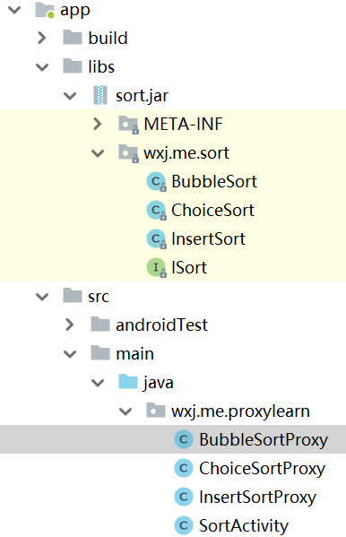

**需求场景**

现有一个 sort.jar 共包含一个 `ISort` 接口和三个实现类，分别为 `BubbleSort`（冒泡排序）、`ChoiceSort`（选择排序）和 `InsertSort`（插入排序）。

```java
//ISort 接口代码如下：
public interface ISort {
    int[] sort(int[] array);
}

//BubbleSort 伪代码如下：
public class BubbleSort implements ISort {
    public int[] sort(int[] array) {
        // 算法的具体实现
        return array;
    }
}
//ChoiceSort、InsertSort 代码与 BubbleSort 类似
```
现在要求项目引入这个 jar 包，并计算出这三种排序方式的耗时。

**静态代理方式**

完成上面需求有多种实现方式，下面我们给出一种方式来解决上面的问题。

`BubbleSort` 实现了 `ISort` 接口，我们创建一个 `BubbleSortProxy` 也实现 `ISort` 接口。要计算出 `BubbleSort` 排序消耗的时间，我们可以在排序前后记录下时间，通过计算前后的时间差就得到了排序消耗的时间。在 `BubbleSortProxy` 中我们引入 `BubbleSort` 作为其成员变量，方便调用 `BubbleSort` 中的 `sort(int[] array)` 方法。

`BubbleSortProxy` 代码如下:
```java
public class BubbleSortProxy implements ISort {

    BubbleSort mBubbleSort;

    public BubbleSortProxy(BubbleSort bubbleSort) {
        mBubbleSort = bubbleSort;
    }

    @Override
    public int[] sort(int[] ints) {
        long start = System.nanoTime();
        int[] intsSorted = mBubbleSort.sort(ints);
        long end = System.nanoTime();
        System.out.println("BubbleSort costs time : " + (end - start));
        return intsSorted;
    }
}
```
`ChoiceSortProxy` 与 `InsertSortProxy` 同 `BubbleSortProxy` 结构类似。

在 `SortActivity` 进行调用，调用代码如下：
```java

public class SortActivity extends AppCompatActivity {

    @Override
    protected void onCreate(Bundle savedInstanceState) {
        super.onCreate(savedInstanceState);
        setContentView(R.layout.activity_main);
        compareCostTime();
    }

    private void compareCostTime() {
   
        System.out.print("未排序数组顺序为：{4, 2, 8, 9, 5, 7, 6, 1, 3}");

        int[] unOrderedInts1 = new int[]{4, 2, 8, 9, 5, 7, 6, 1, 3};
        BubbleSortProxy bubbleSortProxy = new BubbleSortProxy(new BubbleSort());
        bubbleSortProxy.sort(unOrderedInts1);

        int[] unOrderedInts2 = new int[]{4, 2, 8, 9, 5, 7, 6, 1, 3};
        ChoiceSortProxy choiceSortProxy = new ChoiceSortProxy(new ChoiceSort());
        choiceSortProxy.sort(unOrderedInts2);

        int[] unOrderedInts3 = new int[]{4, 2, 8, 9, 5, 7, 6, 1, 3};
        InsertSortProxy insertSortProxy = new InsertSortProxy(new InsertSort());
        insertSortProxy.sort(unOrderedInts3);
    }

}

// 打印结果为：
14535-14535/wxj.me.proxylearn I/System.out: 未排序数组顺序为：{4 2 8 9 5 7 6 1 3}
14535-14535/wxj.me.proxylearn I/System.out: BubbleSort costs time : 16200
14535-14535/wxj.me.proxylearn I/System.out: ChoiceSort costs time : 16590
14535-14535/wxj.me.proxylearn I/System.out: InsertSort costs time : 16990
```
为了计算出三种算法的排序耗时，我们增加了三个类，现在的项目主要结构如图1所示，假想如果 sort.jar 包中有10中排序方法，我们就会增加10个类，并且每个类的代码结构都是相同的。这种实现方式（也叫静态代理方式）明显的缺点是：当排序实现类很多时，由于是1对1代理，增加了很多类。

那我们想既然创建的类代码结构都类似，这些类能不能在需要运行的时候，自动生成，而不用在项目中创建这些类文件呢？




参考链接：

[10分钟看懂动态代理设计模式](https://www.jianshu.com/p/fc285d669bc5)
